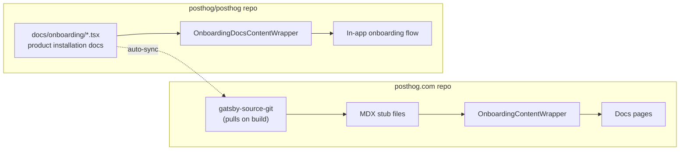

# Shared onboarding docs

This file covers PostHog's **shared onboarding/installation docs** – the special architecture where one source renders content in two places: the in-app onboarding flow and the website's getting started pages.

Load this file only when creating, migrating, or modifying installation/onboarding content for a product.

These are some of the first pieces of docs a new user sees. They show users how to quickly install a product, so they need to be up to date and accurate.

---

## The pattern at a glance

There is a **single source of truth** in the [`posthog/posthog`](https://github.com/PostHog/posthog) repo under [`docs/onboarding/`](https://github.com/PostHog/posthog/tree/master/docs/onboarding). You only update onboarding content there – the website pulls it automatically on its next build.

**Never duplicate onboarding content into the posthog.com repo.** The website only contains thin MDX stubs that import the shared content.

---

## Which products use shared onboarding docs

This is a relatively new pattern, so old onboarding docs are still being migrated. As of February 2026:

| Product | Status |
|---------|--------|
| LLM analytics | Migrated |
| Product Analytics | Migrated |
| Web Analytics | Migrated |
| Session Replay | Migrated |
| Feature Flags | Migrated |
| Experiments | Migrated |
| Error Tracking | Migrated |
| Surveys | Migrated |
| Workflows | Migrated |
| Data Pipelines | Not yet migrated |
| Data Warehouse | Not yet migrated |
| Revenue Analytics | Not yet migrated |
| PostHog AI | Not yet migrated |
| Logs | Not yet migrated |
| Endpoints | Not yet migrated |

---

## How it works

Onboarding content is written once as React components in the monorepo, then rendered in two places:

1. **PostHog monorepo (in-app onboarding):** the PostHog app imports docs components directly and wraps them with `OnboardingDocsContentWrapper`, which provides UI components like `Steps`, `CodeBlock`, etc.
2. **PostHog.com repo (website):** the website pulls docs components from the monorepo via `gatsby-source-git` (a Gatsby plugin), then renders them through MDX stub files that use a similar `OnboardingContentWrapper` to provide compatible UI components.

Both wrappers expose the same component names (`Steps`, `CodeBlock`, `CalloutBox`, etc.), so the shared content renders correctly in either place. When you merge changes to `master` in `posthog/posthog`, the website automatically pulls the updated content on its next build.



### File structure for each repo

```
posthog/posthog
├── docs/onboarding/
│   └── your-product/
│       ├── index.ts              # Barrel file re-exports all Installation components + snippets
│       ├── sdk-name.tsx          # getSteps + createInstallation
│       └── _snippets/
│           └── reusable-snippet.tsx
│
└── frontend/src/scenes/onboarding/
    └── sdks/your-product/
        └── YourProductSDKInstructions.tsx  # withOnboardingDocsWrapper

posthog/posthog.com
└── contents/docs/your-product/
    └── installation/
        ├── sdk-name.mdx          # MDX stub
        └── _snippets/
            ├── prefix-installation-wrapper.tsx  # Single file with ALL wrappers
            └── shared-helpers.tsx               # modifySteps helpers
```

For a complete working example, see the **Session Replay** implementation:

| Repo | File |
|------|------|
| posthog/posthog | [`docs/onboarding/session-replay/`](https://github.com/PostHog/posthog/blob/master/docs/onboarding/session-replay/) |
| posthog.com | [`react.mdx`](https://github.com/PostHog/posthog.com/blob/master/contents/docs/session-replay/installation/react.mdx) |
| posthog.com | [`sr-installation-wrapper.tsx`](https://github.com/PostHog/posthog.com/blob/master/contents/docs/session-replay/installation/_snippets/sr-installation-wrapper.tsx) |

---

## How to create or migrate onboarding docs

### Step 1: Create the shared component in posthog/posthog

1. Navigate to the product directory in `docs/onboarding/`. Create it if needed: `docs/onboarding/your-product/`.
2. Create a new `.tsx` file: `docs/onboarding/your-product/filename.tsx`.
3. Export a step function and Installation component. Use `createInstallation` to handle rendering automatically:

   ```tsx
   // docs/onboarding/feature-flags/python.tsx
   import { OnboardingComponentsContext, createInstallation } from 'scenes/onboarding/OnboardingDocsContentWrapper'
   import { getPythonSteps as getPythonStepsPA } from '../product-analytics/python'
   import { StepDefinition } from '../steps'

   // Step function receives a single context object with all components
   export const getPythonSteps = (ctx: OnboardingComponentsContext): StepDefinition[] => {
       const { CodeBlock, Markdown, dedent, snippets } = ctx

       // Reuse installation steps from product-analytics
       const installationSteps = getPythonStepsPA(ctx)

       // Add feature-flag-specific steps
       const flagSteps: StepDefinition[] = [
           {
               title: 'Evaluate feature flags',
               badge: 'required',
               content: (
                   <>
                       <Markdown>Check if a feature flag is enabled:</Markdown>
                       {snippets?.BooleanFlagSnippet && <snippets.BooleanFlagSnippet />}
                   </>
               ),
           },
       ]

       return [...installationSteps, ...flagSteps]
   }

   // createInstallation wraps your step function into a ready-to-use component
   export const PythonInstallation = createInstallation(getPythonSteps)
   ```

   **Key patterns:**

   - You can reuse installation steps from product analytics by calling their step function with the same context.
   - Step badges include `required`, `optional`, or `recommended`.

4. For reusable snippets, create them in `docs/onboarding/<product>/_snippets/` and export a named component.
5. Create the in-app wrapper in `frontend/src/scenes/onboarding/sdks/your-product/`. Use the `withOnboardingDocsWrapper` helper:

   ```tsx
   // frontend/src/scenes/onboarding/sdks/feature-flags/FeatureFlagsSDKInstructions.tsx
   import { PythonInstallation, BooleanFlagSnippet, MultivariateFlagSnippet } from '@posthog/shared-onboarding/feature-flags'
   import { PythonEventCapture } from '@posthog/shared-onboarding/product-analytics'
   import { withOnboardingDocsWrapper } from '../shared/onboardingWrappers'

   const PYTHON_SNIPPETS = {
       PythonEventCapture,
       BooleanFlagSnippet,
       MultivariateFlagSnippet,
   }

   const FeatureFlagsPythonInstructionsWrapper = withOnboardingDocsWrapper({
       Installation: PythonInstallation,
       snippets: PYTHON_SNIPPETS,
   })

   export const FeatureFlagsSDKInstructions: SDKInstructionsMap = {
       [SDKKey.PYTHON]: FeatureFlagsPythonInstructionsWrapper,
       // ... other SDKs
   }
   ```

6. Test in the app by running the monorepo locally and navigating to `localhost:8010/onboarding`. Select your product and test.

### Step 2: Create the website stub in posthog.com

1. To test locally, point `gatsby-source-git` at your monorepo branch via the `GATSBY_POSTHOG_BRANCH` environment variable:

   ```bash
   GATSBY_POSTHOG_BRANCH=your-branch-name pnpm start
   ```

2. Create a **single TSX wrapper file** at `contents/docs/<product>/installation/_snippets/<prefix>-installation-wrapper.tsx` that exports all SDK wrappers:

   ```tsx
   // contents/docs/session-replay/installation/_snippets/sr-installation-wrapper.tsx
   import React from 'react'
   import {
       JSWebInstallation,
       ReactInstallation,
       NextJSInstallation,
       // ... import all SDK installations
       SessionReplayFinalSteps,
   } from 'onboarding/session-replay'
   import { OnboardingContentWrapper } from 'components/Docs/OnboardingContentWrapper'
   import { addNextStepsStep } from './shared-helpers'

   const SNIPPETS = {
       SessionReplayFinalSteps,
   }

   // Export a wrapper for each SDK
   export const SRJSWebInstallationWrapper = () => (
       <OnboardingContentWrapper snippets={SNIPPETS}>
           <JSWebInstallation modifySteps={addNextStepsStep} />
       </OnboardingContentWrapper>
   )

   export const SRReactInstallationWrapper = () => (
       <OnboardingContentWrapper snippets={SNIPPETS}>
           <ReactInstallation modifySteps={addNextStepsStep} />
       </OnboardingContentWrapper>
   )

   export const SRNextJSInstallationWrapper = () => (
       <OnboardingContentWrapper snippets={SNIPPETS}>
           <NextJSInstallation modifySteps={addNextStepsStep} />
       </OnboardingContentWrapper>
   )

   // ... repeat for all SDKs
   ```

   The `modifySteps` prop lets you add website-specific steps (like "Next steps") that aren't needed in-app.

3. Create an MDX stub file for each SDK at `contents/docs/<product>/installation/<name>.mdx`:

   ```mdx
   ---
   title: React session replay installation
   platformLogo: react
   showStepsToc: true
   ---

   <!--
   This page imports shared onboarding content from the main PostHog repo.
   Source: https://github.com/PostHog/posthog/blob/master/docs/onboarding/session-replay/react.tsx
   -->

   import { SRReactInstallationWrapper } from './_snippets/sr-installation-wrapper.tsx'

   <SRReactInstallationWrapper />
   ```

4. Test locally with `pnpm start` and verify the page renders at the expected URL.
5. Commit and merge **both** the `posthog/posthog` and `posthog/posthog.com` PRs.

---

## Exceptions to the standard pattern

The architecture above works well for products that have their own SDK installation steps – but not every product fits this mold. Some products are exceptions, and that's fine. **Only use shared onboarding when it makes sense.**

### Workflows

Installing an SDK is optional for Workflows, so it doesn't define its own shared doc components. There are **no files in `docs/onboarding/workflows/`**.

Instead, Workflows reuses the Product Analytics `Installation` components directly and transforms them with a `modifySteps` function at the in-app level:

```tsx
// frontend/src/scenes/onboarding/sdks/workflows/WorkflowsSDKInstructions.tsx
import { ReactInstallation, PythonInstallation } from '@posthog/shared-onboarding/product-analytics'
import { withOnboardingDocsWrapper } from '../shared/onboardingWrappers'

// Filter out product-analytics-specific steps and add a workflows-specific final step
function workflowsModifySteps(steps: StepDefinition[]): StepDefinition[] {
    const installationSteps = steps.filter(
        (step) => !['Send events', 'Send an event', 'Send events via the API'].includes(step.title)
    )
    return [
        ...installationSteps,
        {
            title: 'Set up workflows',
            badge: 'recommended',
            content: <WorkflowsFinalStepContent />,
        },
    ]
}

const WorkflowsReactWrapper = withOnboardingDocsWrapper({
    Installation: ReactInstallation,
    modifySteps: workflowsModifySteps,
})
```

This works because Workflows only needs a PostHog SDK installed (the same install steps as Product Analytics), then swaps the final "send events" step for a "set up Workflows" step. Everything lives in a single `WorkflowsSDKInstructions.tsx` file – no shared docs directory, no website stubs.

> **When to use this pattern**: if your product's onboarding is essentially "install the PostHog SDK + do one product-specific thing," consider reusing existing Installation components with `modifySteps` instead of creating a full set of shared doc files. Avoids unnecessary duplication.
